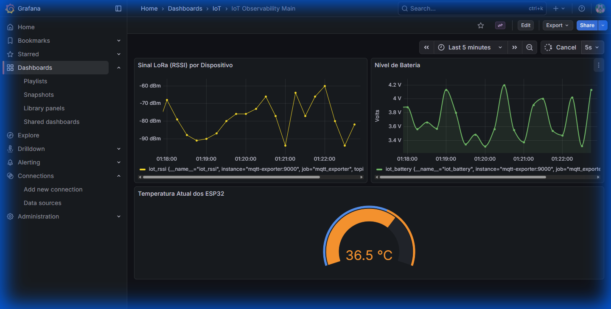
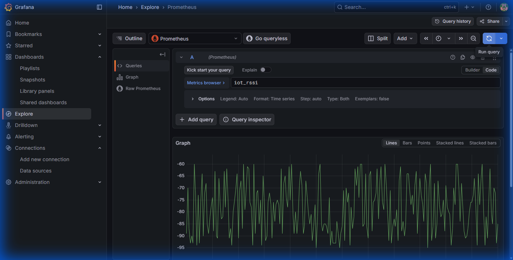

# iot-observability-stack ⭐

Plataforma de observabilidade industrial desenhada para monitorização em tempo real de ecossistemas IoT (ESP32 + LoRa + Laravel). Esta solução implementa uma stack moderna, auto-hospedada e proativa alinhada com as práticas de **SRE (Site Reliability Engineering)**.

## 🚀 Visão Geral
O projeto fornece uma infraestrutura robusta para diagnóstico, telemetria e alertas críticos, garantindo que qualquer falha em ambientes industriais seja detetada em segundos. Integra hardware (ESP32 via LoRa), comunicação (MQTT) e serviços de backend (Laravel) num fluxo de dados unificado.

## 🛠️ Stack Tecnológica
- **Mosquitto (MQTT Broker)**: Porta de entrada para telemetria LoRa/ESP32.
- **MQTT Exporter**: Ponte de dados que converte payloads JSON para métricas formatadas para o Prometheus.
- **Prometheus**: Base de dados de séries temporais para armazenamento escalável e análise de dados históricos.
- **Alertmanager**: Orquestrador de notificações industriais com integração pronta para Telegram.
- **Grafana**: Painéis de visualização de alto desempenho com dashboards pré-provisionados.
- **Laravel Backend**: Integração nativa via endpoint `/prometheus` para monitorizar o estado da infraestrutura de negócio.

## 📊 Visualização de Alto Impacto

### Painel de Controlo Principal

*Vista unificada da saúde dos dispositivos, qualidade de sinal (RSSI), níveis de energia e sensores térmicos em tempo real.*

### Análise Técnica de Métricas

*Exploração granular de frequências e latências de rede através da ferramenta Explore do Grafana.*

## ⚠️ Inteligência Proativa e Alertas
O sistema monitoriza comportamentos anómalos e dispara alertas automáticos para garantir a continuidade operacional:

- **ESP32 Offline**: Deteta a perda de telemetria se o dispositivo não enviar dados por mais de 30 segundos.
- **Degradação de Sinal LoRa**: Alerta quando o RSSI atinge valores críticos (abaixo de -95 dBm).
- **Falha de Energia (Bateria)**: Notificação crítica quando a carga do dispositivo desce dos 3.5V.
- **Indisponibilidade de Backend**: Monitoriza a saúde do servidor Laravel e alerta sobre falhas de ligação.


## ⚙️ Instalação e Execução
Toda a infraestrutura é orquestrada via Docker para garantir consistência entre ambientes.

1. **Clonar o Repositório**:
   ```bash
   git clone https://github.com/smpsandro1239/iot-observability-stack.git
   cd iot-observability-stack
   ```

2. **Iniciar a Stack**:
   ```bash
   docker-compose up -d
   ```

### Acesso aos Serviços Locais:
- **Grafana**: [http://localhost:3000](http://localhost:3000) (admin/admin)
- **Prometheus**: [http://localhost:9090](http://localhost:9090)
- **Alertmanager**: [http://localhost:9093](http://localhost:9093)

## 📘 Configuração das Notificações Telegram
Para ativar alertas reais no seu telemóvel:

1. Edite o ficheiro `alerts/alertmanager.yml`.
2. Substitua o campo `bot_token` pelo token do seu BotFather.
3. Substitua o campo `chat_id` pelo seu ID de utilizador.
4. Reinicie os serviços: `docker-compose restart alertmanager`.

---
**Desenvolvido por Sandro Pereira**
*Foco em Engenharia IoT, Performance e Sistemas de Missão Crítica.*
